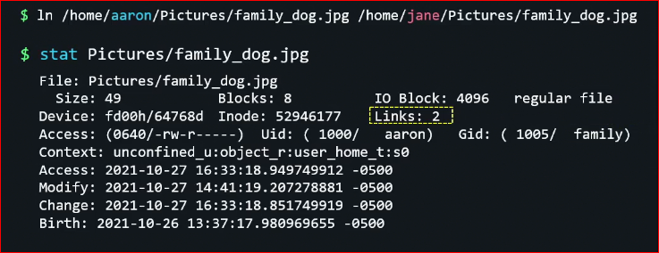

# File System

## Linux Directories

In Linux, files are organized within a hierarchy of directories. Each directory can contain files as well as other directories.

| Directory | Description |
|---|---|
| **/bin** | Contains common Linux user commands, such as ls, sort, date, and chmod |
| **/boot** | Has the bootable Linux kernel, initial RAM disk, and boot loader configuration files (GRUB). |
| **/dev** | Contains files representing access points to devices on your systems. |
| **/etc** | Contains administrative configuration files. |
| **/home** | Contains directories assigned to each regular user with a login account |
| **/media** | standard location for automounting devices (removable media in particular) |
| **/lib** | Contains shared libraries needed by applications in /bin and /sbin to boot the system |
| **/mnt** | A common mount point for many devices before it was supplanted by the standard `/media` directory |
| **/misc** | A directory sometimes used to automount filesystems upon request |
| **/opt** | Directory structure available to store add-on application software |
| **/proc** | Contains information about system resources |
| **/root** | root user's home directory. |
| **/sbin** | Contains administrative commands and daemon processes |
| **/sys** | Contains parameters for such things as tuning block storage and managing cgroups |
| **/tmp** | temporary files used by applications |
| **/usr** | Contains user documentation, games, graphical files (X11), libraries (lib), and a variety of other commands and files that are not needed during the boot process |
| **/var** | Contains directories of data used by various applications. In particular, this is where you would place files that you share as an FTP server (`/var/ftp`) or a web server (`/var/www`). It also contains all system log files (`/var/log`) and spool files in `/var/spool`. The /var directory contains directories and files that are meant to change often. |

## Basic Commands

* `cd` Change to another directory
```
$ cd ~
$ pwd
/home/chris
$ cd ~/Music
$ pwd
/home/chris/Music
```
The tilde (`~`) represents your home directory.

* `ls` to list the files
```
$ ls -la                                                                                                                                                    
total 48
drwxrwxrwx 1 jcasanella jcasanella  4096 Apr 22 07:52 .
drwxrwxrwx 1 jcasanella jcasanella  4096 Apr 22 07:51 ..
drwxrwxrwx 1 jcasanella jcasanella  4096 Apr 23 00:55 .git
-rwxrwxrwx 1 jcasanella jcasanella 14994 Apr 24 00:21 file_system.md
drwxrwxrwx 1 jcasanella jcasanella  4096 Apr 23 22:19 img
-rwxrwxrwx 1 jcasanella jcasanella  7598 Apr 23 00:35 using_man.md
-rwxrwxrwx 1 jcasanella jcasanella 18403 Apr 22 07:51 using_shell.md
-rwxrwxrwx 1 jcasanella jcasanella  3440 Apr 22 07:51 working_with_files.md

Note: list all the files

$ ls -ltr                                                                                                                                                   
total 48
-rwxrwxrwx 1 jcasanella jcasanella 18403 Apr 22 07:51 using_shell.md
-rwxrwxrwx 1 jcasanella jcasanella  3440 Apr 22 07:51 working_with_files.md
-rwxrwxrwx 1 jcasanella jcasanella  7598 Apr 23 00:35 using_man.md
drwxrwxrwx 1 jcasanella jcasanella  4096 Apr 23 22:19 img
-rwxrwxrwx 1 jcasanella jcasanella 14994 Apr 24 00:21 file_system.md

Note: list the files sorted by the last modification

$ ls --full-time                                                                                                                                           
total 48
-rwxrwxrwx 1 jcasanella jcasanella 14994 2022-04-24 00:21:54.495101300 +0100 file_system.md
drwxrwxrwx 1 jcasanella jcasanella  4096 2022-04-23 22:19:55.024783600 +0100 img
-rwxrwxrwx 1 jcasanella jcasanella  7598 2022-04-23 00:35:41.490395700 +0100 using_man.md
-rwxrwxrwx 1 jcasanella jcasanella 18403 2022-04-22 07:51:09.166972600 +0100 using_shell.md
-rwxrwxrwx 1 jcasanella jcasanella  3440 2022-04-22 07:51:09.174974900 +0100 working_with_files.md

Note: Print the full timestamp of the last modification of the file
```

## Metacharacters and operators

### File Metacharacters

There're some characters that makes more easier the work with files. 

| Character | Description |
|---|---|
| * | Matches any number of characters |
| ? | Matches any one character |
| [...] | Matches any of the characters between the brackets |

```
sudo mkdir /tmp/meta
cd /tmp/meta
touch apple.txt cider.sh vinegar.php cat.txt lemon.txt juice.sh catfish.sh 

ls c*
Output:
catfish.sh cat.txt cider.sh

ls c*h
Output:
catfish.sh cider.sh

ls *r*
Output:
cider.sh vinegar.php

sudo rm *p*

ls
Output:
catfish.sh cat.txt cider.sh juice.sh lemon.txt
```

Some examples with `?`

```
ls a???e*
Output:
apple.txt

ls c?t*
Output:
cat.txt    catfish.sh
```
Some examples with `[]`
```
ls [av]* 
Output: (any starting with either a or v)
apple.txt   vinegar.ph


ls [a-j]*
Output: (range between a and j)
apple.txt  cat.txt    catfish.sh cider.sh   juice.sh
```

### File redirection metacharacters

| Character | Description |
|---|---|
| < | Directs the contents of a file to the command |
| > | Directs the standard output of a command to a file. If the file exists, the content of that file is overwritten |
| 2> | Direct error messages to a file |
| &> | Direct standard and error messages to a file |
| >> | Directs the output of a command to a file, adding the output to the end of the existing file |
| 2>&1 | Redirects the standard error to the standard output |
| << | Any text u enter in the standard input is send to the command | 

```
wc -l < .zshrc
Count the number of lines that contents the file .zshrc

ls -ltr > files.txt

echo "I finished the project on $(date)" >> ~/projects

find / -name filaneme.txt 2>/dev/null
Look for a find and send the error messages to /dev/null

find / -name "*.pl" &>filelist.txt
send both stdout and stderr to a file named filelist.txt
```

How to understand 2>&1
```
File descriptor 1 is the standard output (stdout).
File descriptor 2 is the standard error (stderr).

Here is one way to remember this construct (although it is not entirely accurate): at first, 2>1 may look like a good way to redirect stderr to stdout. However, it will actually be interpreted as "redirect stderr to a file named 1". & indicates that what follows and precedes is a file descriptor and not a filename. So the construct becomes: 2>&1.

Consider >& as redirect merger operator.
```

### Brace expansion characters

By using curly braces (`{}`), you can expand out a set of characters across filenames, directory names, or other arguments to which you give commands.

```
$ touch memo{1,2,3,4,5}
$ ls
memo1 memo2 memo3 memo4 memo5

$ touch {John,Bill,Sally}-{Breakfast,Lunch,Dinner}
$ ls
Bill-Breakfast Bill-Lunch John-Dinner Sally-Breakfast Sally-Lunch
Bill-Dinner John-Breakfast John-Lunch Sally-Dinner
$ rm -f {John,Bill,Sally}-{Breakfast,Lunch,Dinner}
$ touch {a..f}{1..5}
$ ls
a1 a3 a5 b2 b4 c1 c3 c5 d2 d4 e1 e3 e5 f2 f4
a2 a4 b1 b3 b5 c2 c4 d1 d3 d5 e2 e4 f1 f3 f5
```

## File permission and ownership

The nine bits assigned to each file for permissions define the access that you and others have to your file. Permission bits for a regular file appear as `-rwxrwxrwx`. Those bits are used to define who can read, write, or execute the file.

For a regular file, a dash appears in front of the nine-bit permissions indicator. Instead of a dash, you might see a d (for a directory), l (for a symbolic link), b (for a block device), c (for a character device), s (for a socket), or p (for a named pipe).

the first three bits apply to the owner's permission, the next three apply to the group assigned to the file, and the last three apply to all others. The r stands for read, the w stands for write, and the x stands for execute permissions. If a dash appears instead of the letter, it means that permission is turned off for that associated read, write, or execute bit.

| Permission | File | Directory |
|---|---|---|
| Read | View what's in the file | See what files and subdirectories it contains |
| Write | Change the file's content, rename it, or delete it | Add files or subdirectories to the directory. Remove files or directories from the directory |
| Execute | Run the file as a program | Change to the directory as the current directory, search through the directory, or execute a program from the directory. Access file metadata (file size, time stamps, and so on) of files in that directory |

you can see the permission for any file or directory by typing the `ls -ld file1 file2`

```
$ ls -ld ch3 test
-rw-rw-r-- 1 joe sales 4983 Jan 18 22:13 ch3
drwxr-xr-x 2 joe sales 1024 Jan 24 13:47 test
```

he first line shows that the ch3 file has read and write permission for the owner and the group. All other users have read permission, which means that they can view the file but cannot change its contents or remove it. The second line shows the test directory (indicated by the letter d before the permission bits). The owner has read, write, and execute permissions while the group and other users have only read and execute permissions. As a result, the owner can add, change, or delete files in that directory, and everyone else can only read the contents, change to that directory, and list the contents of the directory.

### Changing permissions

If you own a file, you can use the `chmod` command to change the permission. Each permission is assigned a number—r=4, w=2, and x=1—and you use each set's total number to establish the permission. 
```
chmod 777 file   --> rwxrwxrwx
chmod 755 file   --> rwxr-xr-x
chmod 644 file   --> rw-r--r--
chmod 000 file   --> ---------
```

you could use the `-R` option to run recursively.

You can also turn file permissions on and off using plus (`+`) and minus (`–`) signs, respectively, along with letters to indicate what changes and for whom. Using letters, for each file you can change permission for the user (`u`), group (`g`), other (`o`), and all users (`a`). What you would change includes the read (`r`), write (`w`), and execute (`x`)

```
chmod a-w file     --> r-xr-xr-x
chmod o-x file     --> rwxrwxrw-
chmod go-rwx file  --> rwx------
```

Using letters to change permission recursively with chmod generally works better than using numbers because you can change bits selectively instead of changing all permission bits at once.

## Setting default permissions

When you create a file as a regular user, it's given permission `rw-rw-r--` by default. A directory is given the permission `rwxrwxr-x`
These default values are determined by the value of `umask`

n practice with umask you can define the permissions of the new files that your process will create.

The user mask contains the octal values of the permissions you want to set for all the new files and to calculate the value of the umask subtract the value of the permissions you want to get from 666 (for a file) or 777 (for a directory).

The umask command masks permission levels by qualifying them with a certain value. To explain further how the umask value is applied, we will illustrate with an example. Let’s say that we want to set the default permissions for all new files or folders to 644 and 755. We would then use the following command.
```
[root@host ~]# umask 022
```
The number "2" permission (write permission) will be "filtered" from the system’s default permissions of 666 and 777 (hence the name “mask.”) From now on, the system will now assign the default permissions of 644 and 755 on new files and directories. Simply put, to calculate the permission bits for a new file or directory, we just subtract the umask value from the default value, like so.

666 - 022 = 644

777 - 022 = 755

## Changing ownership

You can change the owner of a file using the `chown` Need to be run as root. 

```
# chown joe /home/joe/memo.txt
# ls -l /home/joe/memo.txt
-rw-r--r--. 1 joe root 0 Dec 19 11:23 /home/joe/memo.txt
```

Note: only changes the owner, not the group. If we want to change user and group, run:

```
# chown joe:joe /home/joe/memo.txt
# ls -l /home/joe/memo.txt
-rw-r--r--. 1 joe joe 0 Dec 19 11:23 /home/joe/memo.txt
```

Also we can run recursively with the `-R` option

## Moving, copying, removing

* Moving: move a file from one location to another, if exists will override the target file. `mv`

```
$ mv abc def
$ mv abc ~
$ mv /home/joe/mymemos/ /home/joe/Documents/
```

* Copy a file. We use the command `cp`

```
$ cp abc def
$ cp abc ~
$ cp -r /usr/share/doc/bash-completion* /tmp/a/
$ cp -ra /usr/share/doc/bash-completion* /tmp/b/
```

To copy a file, preserving attributes use the paramenter `-p` (means preserve)

The lastest command with the `a` it keeps the source timestamp when executes the copy. Otherwise will use the current timestamp

* Drop file or folder. We can use the commands `rm` and `rmdir`

```
$ rmdir /home/joe/nothing/
$ rm -r /home/joe/bigdir/
$ rm -rf /home/joe/hugedir/
```

## Links

### Hard Links

One important point of a file is the inodes, that helps to find out all the blocks associated to a file. With the command: `stats filename` we can see all the info associated to this file.

```
stat using_man.md                                                                                                                                            ✔  5348  22:10:42
  File: using_man.md
  Size: 7598            Blocks: 16         IO Block: 4096   regular file
Device: fh/15d  Inode: 3096224744276471  Links: 1
Access: (0777/-rwxrwxrwx)  Uid: ( 1000/jcasanella)   Gid: ( 1000/jcasanella)
Access: 2022-04-23 00:53:56.414387600 +0100
Modify: 2022-04-23 00:35:41.490395700 +0100
Change: 2022-04-23 00:35:41.490395700 +0100
 Birth: -
```

In order to share files in the system, we can create hard links. The syntax is `ln target link_name` So now the same file can be accessed from different locations.



in the image we can appreciate, after create a hard link, the number of links have been increased to 2. If one of the users drop the file, the other still can see the data, the explanation is because the number of links is 1, if the 2nd user drops the file, then it's not present anymore at disk. Every time we create a hard link, it increases the links associated to the file and the file will be deleted once the number of links is 0. The hard links can be applied only to files.

### Soft Links

Basically is a file thant points to a specific location, where the real file exists. `ln -s target_file link_name`
If you drop the symbolic link, the file where the symlink points still exists. 
Can be created against files and directories. To see where it points, can use the command `readlink link_name`

## Exercises

### 1. Create a directory in your home directory called projects. In the projects directory, create nine empty files that are named house1, house2, house3, and so on up to house9. Assuming that there are lots of other files in that directory, come up with a single argument to ls that would list just those nine files.
```
# mkdir projects
# cd projects
# touch house{1..9}
# ls -la house[1-9]
```

### 2. Make the `$HOME/projects/houses/doors/` directory path. Create the following empty files within this directory path (try using absolute and relative paths from your home directory):
```
$HOME/projects/houses/bungalow.txt
$HOME/projects/houses/doors/bifold.txt
$HOME/projects/outdoors/vegetation/landscape.txt
 ```

```
cd $HOME/project
mkdir -p houses/doors
cd houses/doors
touch bifold.txt
touch ../bungalow.txt
cd ..
mkdir -p outdoors/vegetation
touch outdoors/vegetation/landscape.txt
```

### 3. Copy the files house1 and house5 to the `$HOME/projects/houses/` directory.

```
cp house[15] houses/.
```

### 4. Recursively copy the `/usr/share/doc/initscripts*` directory to the `$HOME/projects/` directory. Maintain the current date/time stamps and permissions.
```
cp -p -R /usr/share/doc/initscripts* $HOME/projects
```

### 5. Recursively list the contents of the $HOME/projects/ directory. Pipe the output to the less command so that you can page through the output.
```
ls -laR project | less
```

### 6. Remove the files `house6`, `house7`, and `house8` without being prompted.
```
rm -r house[6-8]
```

### 7. Move `house3` and `house4` to the `$HOME/projects/houses/doors` directory.
```
mv house[34] houses/doors/.
```

### 8. Remove the `$HOME/projects/houses/doors` directory and its contents.
```
rm -rf houses/doors
```

### 9. Change the permissions on the `$HOME/projects/house2` file so that it can be read by and written to by the user who owns the file, only read by the group, and have no permission for others.
```
chmod 640 house2
```

### 10. Recursively change permissions of the `$HOME/projects/` directory so that nobody has write permission to any files or directory beneath that point in the filesystem.
```
chmod -R a-w projects 
```