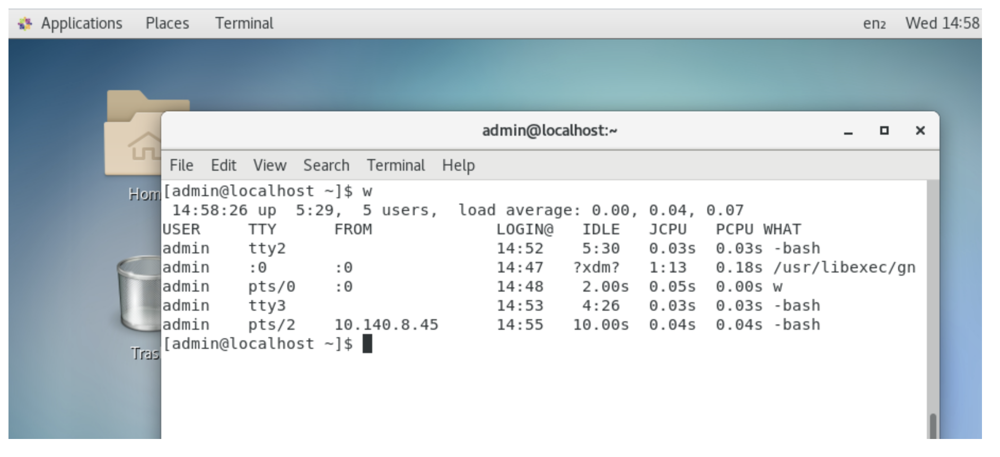

## Using the shell prompt

The default prompt for a regular user is simply a dollar sign: ```$```
The default prompt for the root user is a pound sign (also called a number sign or a hash tag): ```#```

In most Linux systems, the `$` and `#` prompts are preceded by your username, system name, and current directory name. 
For example, a login prompt for the user named `jake` on a computer named pine with `/usr/share/` as the current working directory would 
appear as follows:

```
[jake@pine share]$
```

## Choosing Your Shell

In most Linux systems, your default shell is the bash shell. To find out what is your default login shell, enter the following commands:
```
$ whoami
chris     pts/0      2019-10-21 22:45 (:0.0)
$ grep chris /etc/passwd
chris:x:13597:13597:Chris Negus:/home/chris:/bin/bash
```

When you log in to a Linux system, Linux views you as having a particular identity, which includes your username, group name, user ID, 
and group ID. Linux also keeps track of your login session: It knows when you logged in, how long you have been idle, and where you logged 
in from.

To find out information about your identity, use the id command as follows:
```
$ id
uid=1000(chris) gid=1000(chris) groups=1005(sales), 7(lp)
```

In this example, the username is chris, which is represented by the numeric user ID (**uid**) 1000. The primary group for chris also is called 
chris, which has a group ID (**gid**) of 1000. The user chris also belongs to other groups called sales (**gid 1005**) and lp (**gid 7**). These names and numbers represent 
the permissions that chris has to access computer resources.

You can see information about your current login session by using the `who` command. In the following example, the `-u` option says to add 
information about idle time and the process ID and `-H` asks that a header be printed:
```
$ who -uH
NAME    LINE   TIME          IDLE   PID   COMMENT
chris   tty1   Jan 13 20:57  .      2019
```

The output from this who command shows that the user chris is logged in on tty1 and his login session began at 20:57 on January 13. The IDLE time shows how long the shell has been open without any command being typed 
(the dot indicates that it is currently active). PID shows the process ID of the user's login shell. COMMENT would show the name of the remote computer 
from which the user had logged in, if that user had logged in from another computer on the network, or the name of the local X display if that user 
were using a Terminal window (such as :0.0).

## Locating Commands

Most user commands that come with Linux are stored in the `/bin, /usr/bin`, or `/usr/local/bin` directory. The `/sbin` and `/usr/sbin` directories contain administrative commands.

Here is the order in which the shell checks for the commands you type:

1. **Aliases**. These are names set by the alias command that represent a particular command and a set of options. 
2. **Shell reserved word**. These are words reserved by the shell for special use
3. **Function**. This is a set of commands that is executed together within the current shell.
4. **Built-in command**. This is a command built into the shell. Example: ls, cp, mv
5. **Filesystem command**. This command is stored in and executed from the computer's filesystem.

To determine the location of a particular command, you can use the `type` command. For example, to find out where the `bash` shell command is located, enter the following:
```
$ type bash
bash is /bin/bash
```
If a command resides in several locations, you can add the `-a` option to have all of the known locations of the command printed.

If a command is not in your PATH variable, you can use the `locate` command to try to find it. Using locate, you can search any part of the system that is accessible to you.

```
$ locate chage
/usr/bin/chage
/usr/sbin/lchage
/usr/share/man/fr/man1/chage.1.gz
/usr/share/man/it/man1/chage.1.gz
/usr/share/man/ja/man1/chage.1.gz
/usr/share/man/man1/chage.1.gz
/usr/share/man/man1/lchage.1.gz
/usr/share/man/pl/man1/chage.1.gz
/usr/share/man/ru/man1/chage.1.gz
/usr/share/man/sv/man1/chage.1.gz
/usr/share/man/tr/man1/chage.1.gz
```

If `locate` does not find files recently added to your system, run `updatedb` as root to update the locate database.

## Command History

The shell history is a list of the commands that you have entered before. Using the `history` command in a bash shell, you can view your previous commands.

Keystrokes for Navigating Command Lines

| Keystroke | Full Name | Meaning |
|---|---|---|
| Ctrl F | Character Forward | Go forward one character |
| Ctrl B | Character Backward | Go backward one character |
| Alt F | Word Forward | Go forward one word |
| Alt B | Word Backward | Go backward one word |
| Ctrl A | Beginning of Line | Go to the beginning of the current line |
| Ctrl E | End of Line | Go to the end of the current line |
| Ctrl L | Clear Screen | Clear Screen and leave line  at the top of the screen |
| Ctrl K | Cut end of line | Cut text to the end of the line |
| Ctrl U | Cut beginning of line | Cut text to the beginning of the line |
| Ctrl W | Cut previous word | Cut the word located behind the cursor |
| Alt D | Cut next word | Cut the word following the cursor |
| Ctrl C | Delete whole line | Delete the entire line |

If you enter the command followed by a number lists the the most N recent commands. For example:
```
$ history 8
 382 date
 383 ls /usr/bin | sort -a | more
 384 man sort
 385 cd /usr/local/bin
 386 man more
 387 useradd -m /home/chris -u 101 chris
 388 passwd chris
 389 history 8
 ```
 A number precedes each command line in the list. You can recall one of those commands using an exclamation point (`!`).

 * **!n Run command number**. Replace the **n** with the number of the command line and that line is run. For example, here's how to repeat the date command shown as command number 382 in the preceding history listing:
 ```
 $ !382
 date
 Fri Jun 29 15:47:57 EDT 2019
 ```

 * **!!—!! Run previous command**. Runs the previous command line. Here's how you would immediately run that same date command:
 ```
 $ !!
 date
 Fri Jun 29 15:53:27 EDT 2019
 ```

 * **!?string—? Run command containing string**. This runs the most recent command that contains a particular string of characters. For example, you can run the date command again by just searching for part of that command line as follows:
 ```
 $ !?dat?
 
 date
 Fri Jun 29 16:04:18 EDT 2019
 ```

 ## Expanding commands

 A feature of the shell is the capability to redirect the input and output of commands to and from other commands and files.

 1.  The pipe (`|`) character connects the output from one command to the input of another command. This lets you have one command work on some data and then have the next command deal with the results. 
```
$ cat /etc/passwd | sort | less
```

This command lists the contents of the /etc/passwd file and pipes the output to the sort command. The sort command takes the usernames that begin each line of the /etc/passwd file, sorts them alphabetically, and pipes the output to the less command (to page through the output).

2. Sequential commands (`;`). You can do this by typing several commands on the same command line and separating them with semicolons (;)
```
$ date ; troff -me verylargedocument | lpr ; date
```

3. Background commands (`&`). You can have the commands run in the background by using the ampersand (&). 
```
$ troff -me verylargedocument | lpr &
```
Don't close the shell until the process is completed or that kills the process. 

4. Expanding columns. With command substitution, you can have the output of a command interpreted by the shell instead of by the command itself. In this way, you can have the standard output of a command become an argument for another command. The two forms of command substitution are `$(command)` and \`command\` (backticks, not single quotes).
```
$ vi $(find /home | grep xyzzy)
```
the command substitution is done before the vi command is run. First, the find command starts at the /home directory and prints out all of the files and directories below that point in the filesystem. The output is piped to the grep command, which filters out all files except for those that include the string xyzzy in the filename. Finally, the vi command opens all filenames for editing (one at a time) that include xyzzy

## Shell variables

The shell itself stores information that may be useful to the user's shell session in what are called variables.

You can see all variables set for your current shell by typing the `set` command. A subset of your local variables is referred to as environment variables. Environment variables are variables that are exported to any new shells opened from the current shell. Type `env` to see environment variables.

You can type `echo $VALUE`, where VALUE is replaced by the name of a particular environment variable you want to list. 

Common shell variables

| Variable | Description |
|---|---|
| **BASH** | This contains the full pathname of the bash command. This is usually `/bin/bash`. |
| **BASH_VERSION** | This is a number representing the current version of the `bash`|
| **EUID** | This is the effective user ID number of the current user |
| **FCEDIT** | If set, this variable indicates the text editor used by `fc` to edit history commands. If this variable isn't set, `vi` is used. |
| **HISTFILE** | This is the location of your history file. It is typically located at `$HOME/.bash_history` |
| **HISTFILESIZE** | number of history entries that can be stored. After this number is reached, the oldest commands are discarded. The default value is 1000. |
| **HISTCMD** | returns the number of the current command in the history list |
| **HOME** | your home directory. |
| **HOSTTYPE** | describes the computer architecture on which the Linux system is running. For Intel-compatible PCs, the value is i386, i486, i586, i686, or something like i386-linux. For AMD 64-bit machines, the value is x86_64 |
| **MAIL** | location of your mailbox file. The file is typically your username in the `/var/spool/mail` |
| **OLDPWD** | the directory that was the working directory before you changed to the current working directory |
| **OSTYPE** | identifies the current operating system |
| **PATH** | colon-separated list of directories used to find commands that you type |
| **PPID** | process ID of the command that started the current shell |
| **PROMPT_COMMAND** | command name that is run each time before your shell prompt is displayed |
| **PS1** | sets the value of your shell prompt |
| **PWD** | directory that is assigned as your current directory. This value changes each time you change directories using the cd command |
| **RANDOM** | causes a random number to be generated. The number is between 0 and 99999 |
| **SECONDS** | number of seconds since the time the shell was started |
| **SHLVL** | This is the number of shell levels associated with the current shell session. When you log in to the shell, the SHLVL is 1. Each time you start a new bash command (by, for example, using su to become a new user, or by simply typing bash), this number is incremented |
| **TMOUT** | Number of seconds the shell can be idle without receiving input. After the number of seconds is reached, the shell exits. |

## Defining Alias

Using the alias command, you create a shortcut to any command and options that you want to run later. 
```
$ alias p='pwd ; ls –CF'
$ alias rm='rm -i'
```

You can check which aliases are set by typing the `alias` command. If you want to remove an alias, use `unalias`

## Configure your shell

Several configuration files support how your shell behaves. Some are executed for every user and every shell, whereas others are specific to the user who creates the configuration file.

Note: files in `/etc/` can only be edited by superuser

| File | Description |
|---|---|
| **/etc/profile** | sets up user environment information for every user. It is executed when you first log in. Gathers shell settings from configuration files in the /etc/profile.d directory. |
| **/etc/bashrc** | Executes for every user who runs the bash shell each time a bash shell is opened. Values in this file can be overridden by `~/.bashrc` file |
| **~/.bash_profile** | used by each user to enter information to be usedd in the shell. Executed only once—when the user logs in. By default, it sets a few environment variables and executes the user's .bashrc file. This is a good place to add environment variables because, once set, they are inherited by future shells. |
| **~/.bashrc** | contains the information that is specific to your bash shells. It is read when you log in and also each time you open a new bash shell. This is the best location to add aliases so that your shell picks them up. |
| **~/.bash_logout** | executes each time you log out |

## Help about commands

1. `help` command. For help with a particular built-in command, enter `help` command, replacing command with the name that interests you. The help command works with the bash shell only.

2. Use `--help` with the command. Many commands include a --help option that you can use to get information about how the command is used. 

3. Use `info` command. 

4. Use `man` command. A description of the command and its options appears on the screen. It's the most common way of getting information about commands. Each man page falls into one of the categories listed in the table.

| Section Number | Section Name | Description |
|---|---|---|
| **1** | User commands | Commands that can be run from the shell by a regular user |
| **2** | System calls | Programming functions used within an application to make calls to the kernel |
| **3** | C library functions | Programming functions that provide interfaces to specific programming libraries |
| **4** | cDevices and special files | Filesystem that represent hardware devices (such as Terminals or CD drives) or software devices (such as random number generators) |
| **5** | File Formats and Conventions | Types of files (such as a graphics or word processing file) or specific configuration files (such as the passwd or group file) |
| **6** | Games | Games available on the system |
| **7** | Miscellaneous | Overviews of topics such as protocols, filesystems, character set standards, and so on |
| **8** | System administration tools and daemons | Commands that require root or other administrative privileges to use |

Options to the man command enable you to search the man page database or display man pages on the screen. Using the `-k` option, you can search the name and summary sections of all man pages installed on the system

Note:

If man `-k` displays no output, it may be that the man page database has not been initialized. Type `mandb` as root to initialize the man page database.

## Exercises

### 1. From your desktop, switch to the third virtual console and log in to your user account. Run a few commands. Then exit the shell and return to the desktop.

In Linux, connections to the operating system may be made by:
* physical terminal session / console session
* pseudo terminal session such as SSH, xterm (for X-Windows)
* virtual hardware terminal session

To show the identification of these different connections, use the "`w`" command:



Refer to the TTY column:

* tty2 and tty3 refer to virtual terminal sessions
* :0 refers to the physical terminal, or in this case the console launched from Prism Element
* pts/0 and pts/2 refer to pseudo terminal sessions, which is the terminal session visible (refer to FROM column :0), and a remote SSH session

When running a Linux guest Virtual Machine, it may necessary to access the virtual terminal sessions for troubleshooting purposes, or to execute commands not available in SSH or other.

Use the Linux `chvt` (Change Virtual Terminal) command.
Start a pseudo terminal session on the console, execute `sudo chvt 3` to change to TTY2 at the command prompt.
Change to TTYN using `sudo chvt N` where N represents the terminal number
To return to the graphical desktop session, use `sudo chvt 1`.

https://portal.nutanix.com/page/documents/kbs/details?targetId=kA00e000000CuNvCAK

### 2. Find the location of the mount command and the tracepath man page.

There're different ways to look for a command:

```
type mount
find / -name mount 2>/dev/null

locate tracepath

Note: if locate does not work, remember to enable the db running infodb as root
```

### 3. Type the following three commands, and then recall and change those commands as described:
```
 $ cat /etc/passwd
 $ ls $HOME
 $ date
 ```

1. Use the command-line recall feature to recall the cat command and change `/etc/passwd` to `/etc/group`.
2. Recall the ls command, determine how to list files by time (using the man page), and add that option to the ls $HOME command line.
3. Add format indicators to the date command to display the date output as month/day/year.

Press up arrow until u see the `/etc/passwd` and edit to `/etc/group`

Run `man ls` to see the different options. The option is `-t`. Use again up arrow until see the ls and edit to add the option. `ls -t $HOME`

Again run `man date` to see the different options. Up arrow unti finde `date`. The way to format is: `date "+DATE: %m/%d/%Y"`